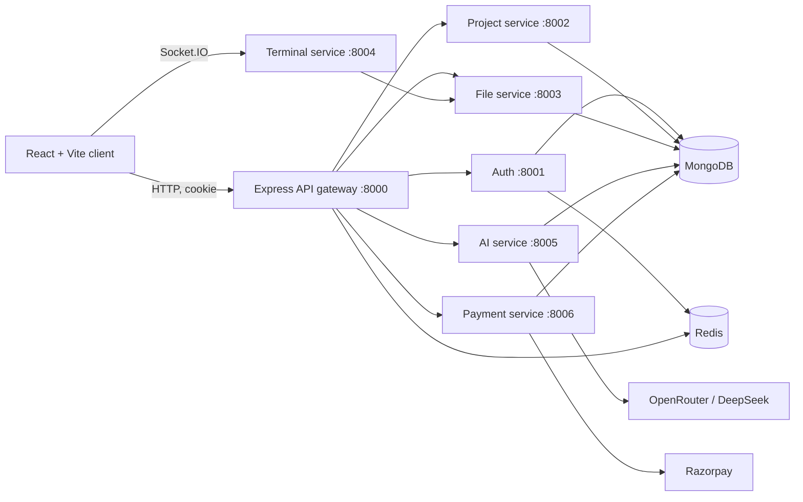

<h1 align="center">✨ VertexAI ✨</h1>

<p align="center">
  <em>An AI-assisted web IDE for the modern developer.</em>
</p>

<p align="center">
  
  
  
  
  
  
  
</p>

VertexAI is a powerful AI-assisted web IDE. It allows authenticated users to create projects, manage a virtual file tree, edit code in a Monaco-powered workspace, run commands in a real terminal, preview static web projects, and collaborate with an AI agent to create or modify files.

The application is built on a microservices architecture, split into a React/Vite frontend, an Express API gateway, and highly focused backend services for authentication, projects, files, AI, payments, and terminal sessions.

> 🚨 **Security First:** This application requires private environment variables and a Firebase Admin service-account file. They are intentionally ignored by Git. **Do not commit or upload them.** If an existing Firebase key is ever committed or shared publicly, revoke and replace it immediately in Google Cloud/Firebase.

---

## 🚀 Key Features

*   🔐 **Secure Authentication:** Google sign-in via Firebase Auth, backed by server-verified ID tokens.
*   🛡️ **Robust Sessions:** Redis-backed, HTTP-only login sessions managed through the API gateway.
*   📁 **Project Management:** Personal dashboard with creation, listing, starring, deletion, and credit display.
*   📝 **Advanced Code Editor:** Monaco editor integration with tabs, dirty state tracking, and `Ctrl/Cmd + S` saving.
*   🌳 **Virtual File System:** Hierarchical project files and folders persisted in MongoDB.
*   🌐 **Live Preview:** Sandboxed in-browser preview assembled dynamically from your `index.html`, CSS, and JS.
*   💻 **Real Terminal:** Socket.IO terminal backed by `node-pty`. Each project is materialized locally before the shell starts.
*   🤖 **AI Pair Programmer:** Streaming AI chat powered by LangGraph & OpenRouter (DeepSeek) with file-management capabilities.
*   💳 **Monetization:** Razorpay checkout integration for Pro and Team credit plans.

---

## 🏗️ Architecture



### 🔄 Request Flow

1. **Authentication:** The frontend signs the user in via Google and sends the Firebase ID token to the Auth service through the gateway.
2. **Session Creation:** Auth verifies the token, creates/finds a MongoDB user, and establishes a 7-day Redis session. The browser receives an HTTP-only `session` cookie.
3. **Routing:** Protected gateway routes load the session and pass the user ID to internal services via the `x-user-id` header.
4. **File Management:** File services enforce ownership. Files are stored as MongoDB documents and rebuilt dynamically on read.
5. **AI Integration:** AI requests deduct credits, then stream Server-Sent Events (SSE) while a LangGraph agent reads/updates project files.
6. **Terminal Sync:** Opening the terminal syncs the project tree from MongoDB to a host workspace and starts a shell instance.

---

## 📂 Repository Layout

```text
.
├── frontend/                     # React 19 + Vite client
│   └── src/
│       ├── components/           # IDE, dashboard, terminal, payments UI
│       ├── features/             # API clients
│       ├── pages/                # Dashboard and project workspace
│       └── redux/                # User and project state
└── backend/
    ├── gateway/                  # Auth guard and reverse proxy
    ├── shared/redis/             # Shared Redis client
    └── services/
        ├── auth/                 # Firebase verification, users, credits
        ├── project/              # Project CRUD and starring
        ├── file/                 # File/folder CRUD and tree construction
        ├── terminal/             # Socket.IO / node-pty terminal
        ├── ai/                   # LangGraph agent and SSE stream
        └── payment/              # Razorpay order and verification

```

---

## 🛠️ Tech Stack

| Area | Technologies |
| --- | --- |
| **Frontend** | React 19, Vite, Tailwind CSS, Redux Toolkit, React Router, Framer Motion |
| **IDE Components** | Monaco Editor, xterm.js, Socket.IO client |
| **Backend** | Node.js, Express 5, Mongoose, Redis/ioredis, Socket.IO, node-pty |
| **AI Integration** | LangChain, LangGraph, OpenRouter (`deepseek/deepseek-chat`) |
| **Identity** | Firebase Authentication and Firebase Admin |
| **Payments** | Razorpay |
| **Database** | MongoDB and Redis |

---

## ⚙️ Local Setup Steps

### Prerequisites

* **Node.js:** 20+ (Tested with v22) & **npm:** 10+
* **Databases:** MongoDB (local or Atlas) and Redis 7+ (Docker Compose provided).
* **Firebase:** Project with Google sign-in enabled + Admin service account JSON.
* **APIs:** OpenRouter API key & Razorpay credentials (if testing payments).
* **System:** A system shell supported by `node-pty` (PowerShell on Windows, Bash on Linux/macOS).

### 1. Install Dependencies

Install the shared backend dependency, each microservice, and the frontend. Run this in your terminal:

```powershell
cd backend
npm ci

cd gateway; npm ci
cd ../services/auth; npm ci
cd ../project; npm ci
cd ../file; npm ci
cd ../terminal; npm ci
cd ../ai; npm ci
cd ../payment; npm ci

cd ../../../frontend
npm ci

```

### 2. Start Redis

Spin up the local Redis instance using Docker:

```powershell
cd backend
docker compose up -d

```

*(Exposes Redis at `redis://localhost:6379`)*

### 3. Configure Environment Variables

Create the following `.env` files in their respective directories. Replace placeholder strings with your actual keys.

**`backend/gateway/.env`**

```dotenv
PORT=8000
FRONTEND_URL=http://localhost:5173
AUTH_SERVICE=http://localhost:8001
PROJECT_SERVICE=http://localhost:8002
FILE_SERVICE=http://localhost:8003
TERMINAL_SERVICE=http://localhost:8004
AI_SERVICE=http://localhost:8005
PAYMENT_SERVICE=http://localhost:8006

```

**`backend/services/auth/.env`**

```dotenv
PORT=8001
MONGODB_URI=mongodb://127.0.0.1:27017/vertexai
REDIS_URL=redis://127.0.0.1:6379

```

*Note: Download your Firebase Admin JSON and save it EXACTLY as `backend/services/auth/serviceAccountKey.json`.*

**`backend/services/project/.env`**

```dotenv
PORT=8002
MONGODB_URI=mongodb://127.0.0.1:27017/vertexai
REDIS_URL=redis://127.0.0.1:6379

```

**`backend/services/file/.env`**

```dotenv
PORT=8003
MONGODB_URI=mongodb://127.0.0.1:27017/vertexai
REDIS_URL=redis://127.0.0.1:6379

```

**`backend/services/terminal/.env`**

```dotenv
PORT=8004
FRONTEND_URL=http://localhost:5173
FILE_SERVICE_URL=http://localhost:8003
# Optional: WORKSPACE_ROOT=C:\\temp\\virtual-code-projects
# Optional: SHELL=powershell.exe

```

**`backend/services/ai/.env`**

```dotenv
PORT=8005
MONGODB_URI=mongodb://127.0.0.1:27017/vertexai
FRONTEND_URL=http://localhost:5173
AUTH_SERVICE_URL=http://localhost:8001
FILE_SERVICE_URL=http://localhost:8003
OPENROUTER_API_KEY=your_openrouter_key

```

**`backend/services/payment/.env`**

```dotenv
PORT=8006
MONGODB_URI=mongodb://127.0.0.1:27017/vertexai
REDIS_URL=redis://127.0.0.1:6379
RAZORPAY_KEY_ID=your_razorpay_key_id
RAZORPAY_KEY_SECRET=your_razorpay_key_secret
AUTH_SERVICE_URL=http://localhost:8001

```

**`frontend/.env`**

```dotenv
VITE_SERVER_URL=http://localhost:8000
VITE_TERMINAL_URL=http://localhost:8004
VITE_FIREBASE_API_KEY=your_firebase_web_api_key

```

### 4. Run the Application

Because this is a microservices architecture, you'll need to run each service in a separate terminal tab/window:

```powershell
# API gateway
cd backend/gateway; npm run dev

# Microservices
cd backend/services/auth; npm run dev
cd backend/services/project; npm run dev
cd backend/services/file; npm run dev
cd backend/services/terminal; npm run dev
cd backend/services/ai; npm run dev
cd backend/services/payment; npm run dev

# Frontend (Open this URL: http://localhost:5173)
cd frontend; npm run dev

```

---

## 🔌 API Overview

*All routes below (except `/api/auth/*`, `/`, and the terminal Socket.IO server) are protected by the gateway's Redis session middleware.*

| Gateway Path | Service Capability |
| --- | --- |
| `POST /api/auth/login` | Verify a Firebase token and create a session |
| `GET /api/auth/logout` | Clear the server-side session |
| `GET /api/me` | Read the session user |
| `/api/project` | Create, list, retrieve, star, and delete projects |
| `/api/file` | Create roots/files/folders, retrieve files, update files, build trees |
| `POST /api/ai/chat/stream` | Credit-gated Server-Sent Event AI coding stream |
| `/api/payment` | Create and verify Razorpay orders |
| `/api/terminal` | Gateway proxy for terminal HTTP endpoints |

---

## 📝 Important Implementation Notes

* **Terminal Security:** The terminal runs a real shell on the host machine. **Do not expose it publicly** without robust auth, container isolation (e.g., Docker per workspace), command policies, and rate limits.
* **Payments:** This implementation credits the user after checkout verification. A production setup *must* also validate Razorpay webhooks server-side.
* **Cookies:** The app's session cookie is configured as `Secure` and `SameSite=None`. In local development, you may need to adjust browser cookie rules, run a local HTTPS proxy, or use a dev-only cookie configuration.

---

## ✅ Verification & Build

Before pushing new changes, always build and lint the frontend:

```powershell
cd frontend
npm run lint
npm run build


# Link your local repository to GitHub
git remote add origin https://github.com/YOUR_GITHUB_USERNAME/vertexai.git

# Push your code up to GitHub
git push -u origin main
